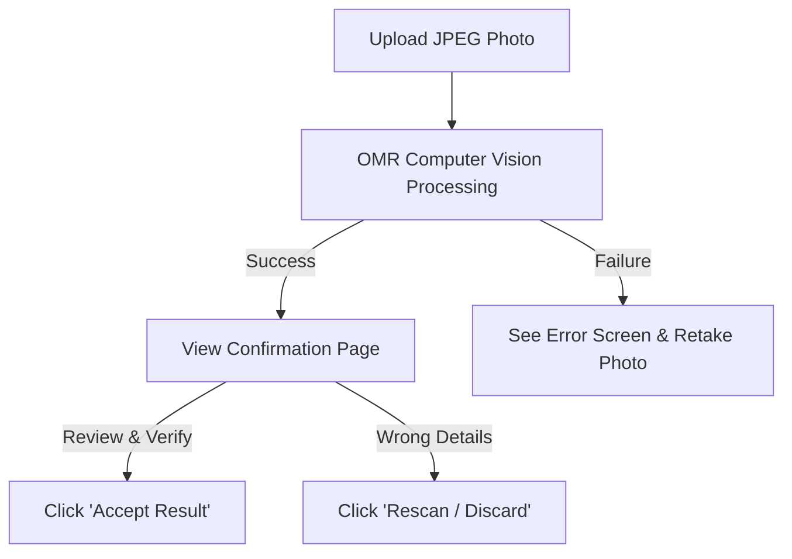

# BKJ Quiz Master — Operator User Manual

Welcome to the **Bharat Ko Jano (BKJ) Quiz Master OMR Scanner** user manual. This guide is designed to help operators and administrators set up, scan, evaluate, and manage OMR sheets and quiz rankings successfully.

---

## 1. Scanner Operator Setup

### Step 1: Login
* Open your browser and navigate to the application URL (e.g., `https://bharatkojano.onrender.com`).
* Log in using your operator or administrator credentials.

### Step 2: Enter Evaluator Name
* Upon logging in or clicking **OMR Scanner** in the sidebar, you will be prompted to enter your **Evaluator Name**.
* **Rule**: Enter your actual name (e.g., `Amit Sharma`). All OMR scans you evaluate will be tagged with your name for audit logs.
* You can change your active session evaluator name from the homepage or sidebar at any time.

---

## 2. Photo Capturing Guidelines (Crucial for Mobile Phones 📱)

To ensure **100% scanning success** and avoid errors, operators must follow these camera guidelines when taking photos of OMR sheets:

> [!IMPORTANT]
> **Check your Phone Camera Settings before you begin:**
> 1. **Camera Ratio**: Set your camera aspect ratio to **`4:3`** (standard). Do **NOT** use `16:9` or `Full Screen` mode, as it crops out the corners of the sheet.
> 2. **Save Format**: Set format to **`Most Compatible` (JPEG / JPG)**. Do **NOT** use `High Efficiency` (HEIC / HEIF) format (common on iPhones and premium Androids), as web servers cannot read HEIC.
> 3. **Resolution**: Shoot in standard photo mode. Do **NOT** use `Ultra-Res`, `50MP`, or `108MP` modes as they waste bandwidth and cause slow processing.

### Taking the Photo:
* **Position**: Hold the phone **directly above** the OMR sheet, parallel to the table. Avoid taking photos from steep side angles.
* **Keep Corners Visible**: All **4 black corner square brackets** must be fully visible inside the camera frame. If even one corner is cropped out, folded, or covered by a finger, the scan will fail.
* **Focus**: Tap the screen on your phone to force auto-focus. Blurry images will fail bracket and bubble detection.
* **Lighting**: Avoid strong shadows (e.g., overhead lights blocked by your body or hands) cast across the bubble grids.

---

## 3. Evaluating a Single OMR Scan

### Step 1: Upload
* Go to the **OMR Scanner** page in the sidebar.
* Select the OMR sheet photo (`.jpg` or `.png`) and click **Upload & Evaluate**.

### Step 2: Verification Page
If the scan is successful, you will be redirected to the **Verification Page**:
* Check the **Student Details** (Name, School Name, Category).
* Check the **Roll Number Grid** and **Exam Set (A/B)** bubbles shown on screen.
* Review the **Marked Answer Grid** to ensure it aligns with the physical sheet.

### Step 3: Accept or Discard
* **Accept**: If everything is correct, click the green **`Accept Result`** button. The score is saved, and the sheet is officially recorded.
* **Rescan / Discard**: If the roll number or details were detected incorrectly, click the red **`Rescan`** button. This deletes the current scan and redirects you back to scan it again.

---

## 4. Handling Warnings & Errors

### Error A: "Could not find all 4 corner registration marks."
* **Why**: The scanner missed the black corner brackets.
* **Fix**: Retake the photo making sure the phone is steady, the page is flat, and all 4 brackets are clearly in frame.

### Error B: "Could not clearly read the 5-digit roll number."
* **Why**: The student bubbled multiple numbers in a single column, left a column blank, or bubbled too lightly.
* **Fix**: Fill in the bubbles darkly on the physical sheet and retake the photo.

### Warning: "Duplicate Scan Alert" (Yellow warning screen)
* **Why**: This student's roll number has already been scanned and accepted.
* **Fix**: 
  * If this new scan is correct, click **Replace Scan** (Admin only) to wipe the old score and save this one.
  * If you scanned it by mistake, click **Discard Scan** to keep their old score.

---

## 5. Answer Key Management (Admin Only 🔑)

To prevent accidental changes to answer keys during active scanning:
* The entire **Answer Keys** module automatically **locks** once all 4 keys (Junior A/B, Senior A/B) are configured.
* **To Edit**: Click the **Unlock** button on the Answer Keys page and enter the master password: **`bkj_qms_2026`**.
* **Evaluation Lock**: If OMR sheets have already been evaluated using a key, that key is locked at the database level. To edit it, you must delete the student results that depend on it first.

---

## 6. Leaderboard, Deletion & Rankings Export

### Leaderboards & Standings
* Go to **Results** to see real-time student grades, percentages, and correct/incorrect breakdown.
* **Rankings** are calculated using **Dense Rankings** (e.g. ties share the same rank, and the next student is ranked immediately next, like `1, 2, 2, 3`).

### Deleting Records
* **Deleting a Scan**: Go to **Results**, click **View** on a student, scroll to the bottom, and click **`Delete & Re-scan`**.
* **Deleting a Student Profile**: Go to **Participants** and click the red **Trash Can** icon next to their row. This will automatically delete their profile, their scan, and their results.

### Download Standings
* Go to the **Leaderboard** or **Reports** page and click **Download Rankings Excel**.
* The downloaded file is generated in real-time. If you delete a student on the website and download it again, the Excel file will immediately reflect the update.
* **Excel sheet password**: The rankings spreadsheet protection password is **`bkj_qms_2026`**.
